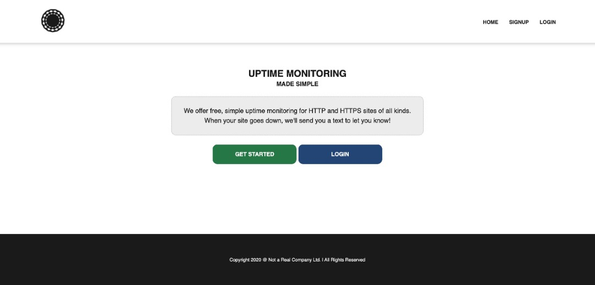
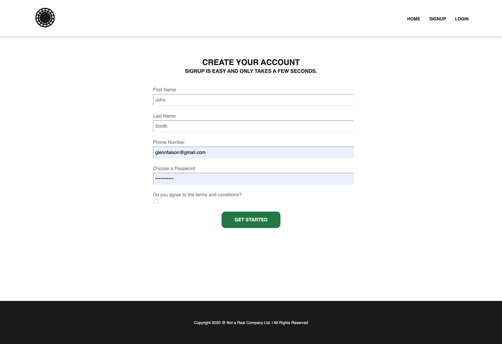
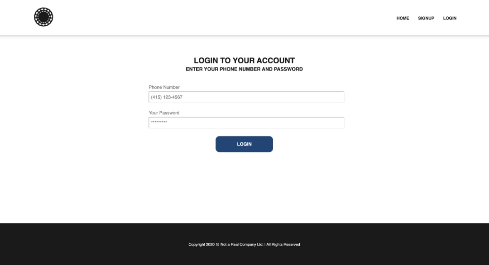
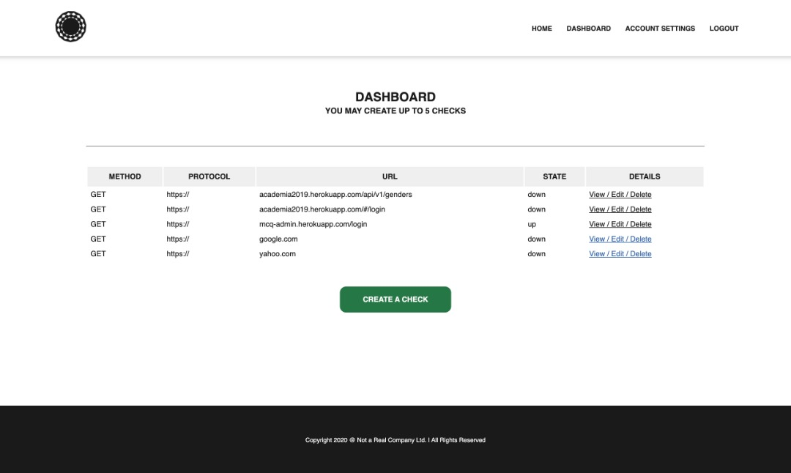
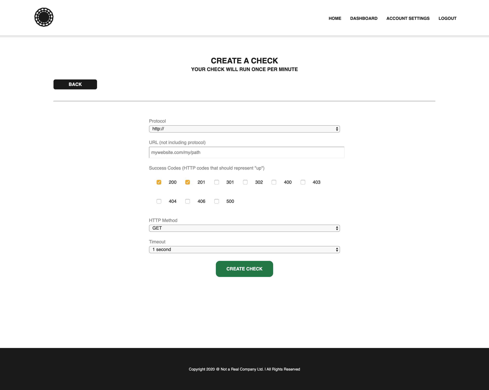
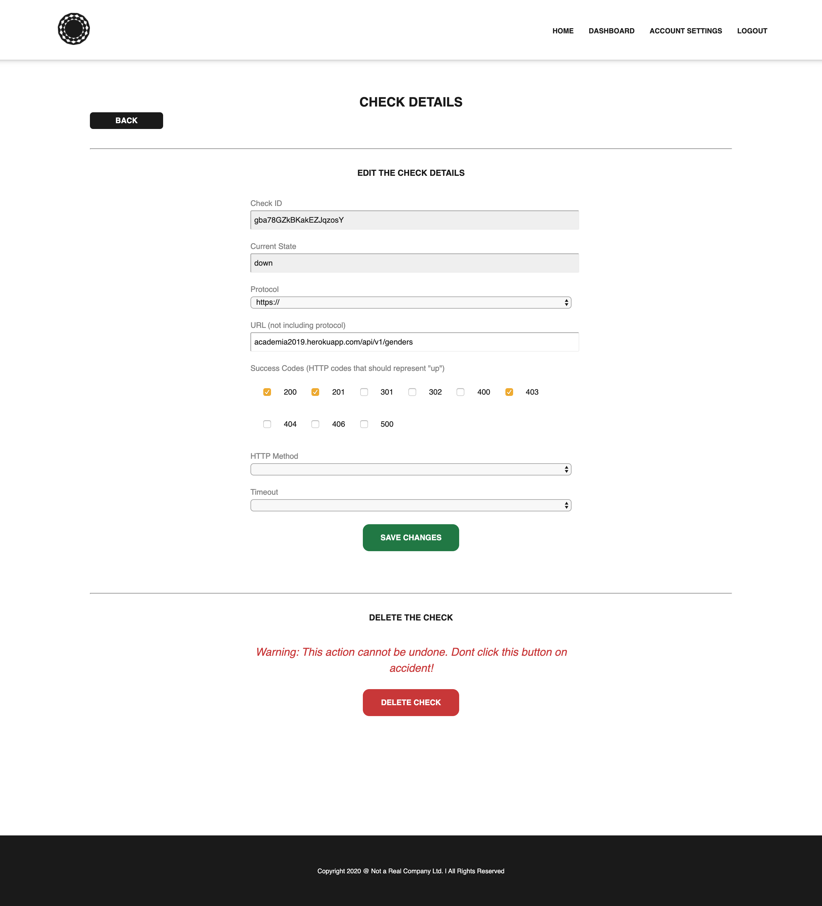
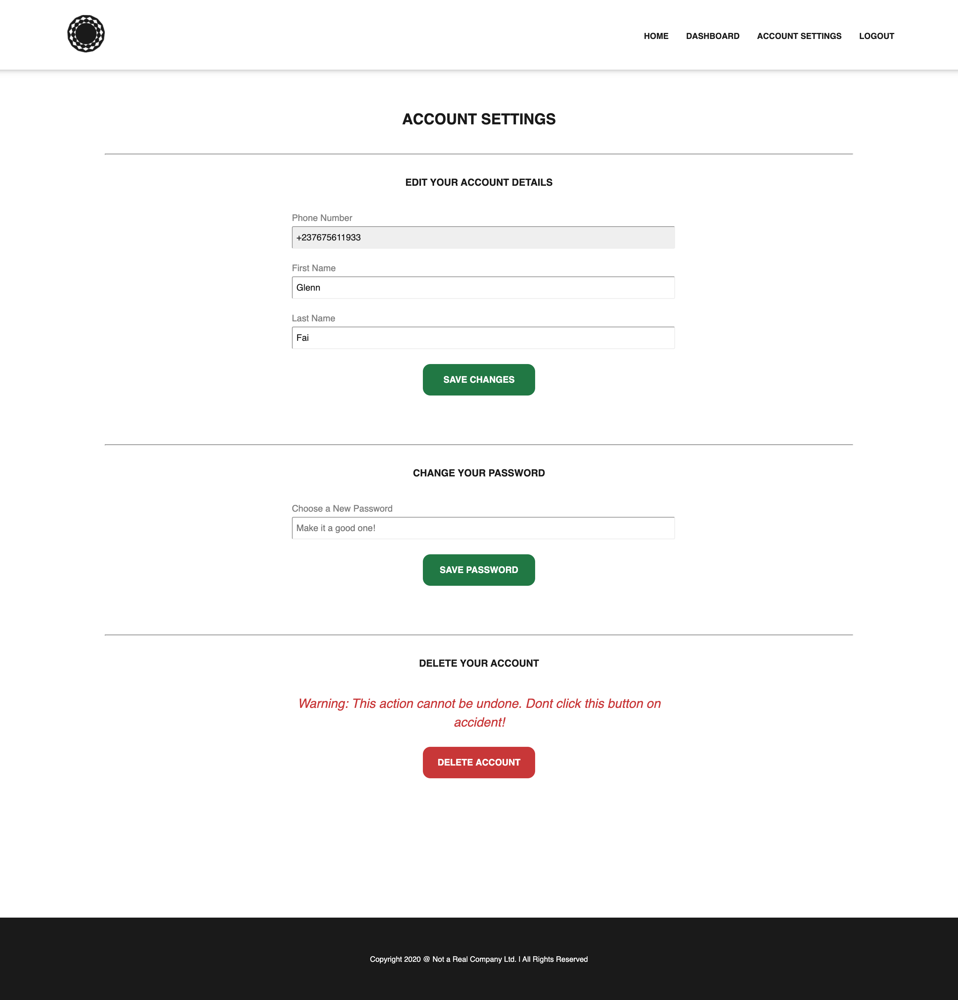

# Uptime Checker

This application lets users create accounts, register web resources whose availability they would like to monitor, and specify details about the requests they want to make to these resources.

The application will periodically make an HTTP request to these resources, and notify the owners of the checks whenever there is a change in state with the specified resources, i.e., if the state changes from "up/accessible" to "down/inaccessible"

## Motivation

This project was made for demonstration purposes. I built every part of the application from scratch, using only the default Node.js modules. No package.json. No NPM.

## The application

The application consists of 3 main parts:
- a REST API
- a user-facing web application
- and a command-line interface for the application administrator to monitor the application.

## What did I have to do?

To bring this project to fruition, I had to build (and name 🤣) the following:
- An HTTP/HTTPS server with integrated routing functions and the ability to add plugins. It is a minimal express.js clone, [srvr](./lib/srvr)
- An Axios clone to help make HTTP requests within the application, [paxios](./lib/paxios)
- A JSON, file-based data storage utility.
- A Twilio SMS API client to notify the application’s users, [twilight](./lib/twilight)
- A REPL library for the CLI(used as admin panel) of the application
- A templating engine for rendering the application’s HTML, [templatr](./lib/templatr)
- A rudimentary unit testing toolkit for testing the application, [litmus](./lib/litmus)

Through this project, I sought to demonstrate my knowledge of the Node.js API, along with my problem-solving skills with low-level Node.js.

## Run the project

- Clone this project, e.g., `git clone https://github.com/glennfaison/uptime-checker`
- Open the project directory in your terminal, e.g., `cd uptime-checker`
- Create a file at `./lib/twilight/twilio.config.json`, and use `./lib/twilight/twilio.config.json.example` as template. Fill in the details of your Twilio service account to enable the SMS notifications.
- Start the project with `node .` or `node index.js`.
- If you want to include the clustering/multithreading feature, run `node index-cluster.js`

## Screens

### Home

### Register

### Sign In

### Dashboard

### Create a check

### Update/delete a check

### Account Settings
